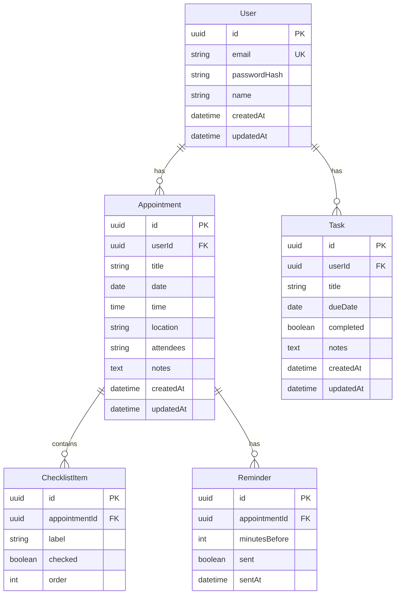

# Tetherly — Personal Appointment & Task Manager

## Product Requirements Document (PRD) v3

---

## 1. Project Overview

**App Name:** Tetherly

The objective is to develop a web-based application that helps users manage appointments and personal tasks in a single place. The application should allow quick entry of appointments that come from different sources such as phone calls, emails, or paper notes.

The first version will be a simple web application (MVP). Mobile apps may be considered later.

---

## 2. Target Users

The primary users are individuals and families who manage many appointments and tasks. Examples include:

- Doctor appointments
- School meetings
- Apartment viewings
- Travel plans
- Personal tasks

---

## 3. Core Objectives

- Allow quick creation of structured appointments
- Provide a dashboard showing upcoming events
- Support task management
- Allow preparation notes and checklists
- Provide reminders for appointments
- Allow optional sharing with family members *(post-MVP)*

---

## 4. Core Features (MVP)

- User login using email and password
- Dashboard with today's appointments and upcoming events
- Appointment creation form with title, date, time, location, attendees, notes, and checklist
- Calendar view with daily, weekly, and monthly views
- Task management with due dates and completion status
- Reminder notifications via email
- Preparation checklist attached to appointments

---

## 5. Future Features

- Email-to-appointment automation
- Integration with Google Calendar and Outlook
- Native mobile applications (iOS and Android)
- Voice-based appointment entry
- Family member sharing (shared calendars or per-appointment sharing)

---

## 6. Data Model

### Entity Relationship Diagram

### Entity Definitions

| Entity | Description |
|--------|-------------|
| **User** | Authenticated user; owns appointments and tasks |
| **Appointment** | Scheduled event with date, time, location; may have checklist and reminders |
| **Task** | Standalone to-do item with due date; independent of appointments (optional future link) |
| **ChecklistItem** | Preparation item attached to an appointment; has label and completion status |
| **Reminder** | Email reminder for an appointment; configurable timing (e.g., 24h, 1h before) |

---

## 7. User Flows

### Sign-up Flow
1. User visits app → Sign-up page
2. Enters email, password, name
3. Submits → Account created → Redirect to dashboard

### Login Flow
1. User visits app → Login page
2. Enters email and password
3. Submits → Authenticated → Redirect to dashboard

### Create Appointment Flow (Target: <15 seconds)
1. User clicks "New Appointment" (or shortcut)
2. Modal/form opens with minimal required fields (title, date, time)
3. User fills title, date, time (required)
4. Optionally adds location, attendees, notes, checklist items
5. Clicks Save → Appointment created → Confirmation

### View Dashboard
1. User logs in → Dashboard loads
2. Sees today's appointments and upcoming events
3. Can click to view details or edit

---

## 8. Reminder Specification

- **Default timing:** 24 hours before and 1 hour before appointment
- **Configurable:** User can set custom reminder times per appointment (e.g., 1 day, 2 hours, 30 min)
- **Delivery:** Email via Resend
- **Failure handling:** Log failed sends; consider retry (e.g., 2 retries with backoff)
- **Content:** Subject: "Reminder: [Appointment Title]"; Body: date, time, location, link to view

---

## 9. API Design

### Base URL
`/api/v1`

### Endpoints

| Method | Endpoint | Description |
|--------|----------|-------------|
| POST | `/auth/register` | Create account |
| POST | `/auth/login` | Login |
| POST | `/auth/logout` | Logout |
| GET | `/appointments` | List appointments (filter by date range) |
| POST | `/appointments` | Create appointment |
| GET | `/appointments/:id` | Get appointment by ID |
| PUT | `/appointments/:id` | Update appointment |
| DELETE | `/appointments/:id` | Delete appointment |
| GET | `/tasks` | List tasks |
| POST | `/tasks` | Create task |
| PUT | `/tasks/:id` | Update task (including completion) |
| DELETE | `/tasks/:id` | Delete task |
| GET | `/checklist` | List checklist items (filter by `appointmentId`) |
| POST | `/checklist` | Create checklist item (body: `appointmentId`, `label`, `order?`) |
| PUT | `/checklist/:id` | Update checklist item (toggle `checked`, update `label`) |
| DELETE | `/checklist/:id` | Delete checklist item |
| GET | `/dashboard` | Dashboard data (today + upcoming) |

---

## 10. Error Handling & Validation

| Scenario | Behavior |
|----------|----------|
| Overlapping appointments | Allow; optionally show warning in UI |
| Past date for appointment | Allow creation; no reminder sent for past |
| Missing required fields | Return 400 with field-level errors |
| Invalid email format | Client + server validation; reject |
| Unauthenticated request | Return 401; redirect to login |
| Not found (e.g., appointment ID) | Return 404 |

---

## 11. UI Requirements

- Simple and fast interface
- **Target:** Create a new appointment in less than 15 seconds
- Mobile responsive
- **Accessibility:** WCAG 2.1 AA target; keyboard navigation and screen reader support

---

## 12. Non-Functional Requirements

- **Performance:** Page load < 3 seconds on typical connection
- **Availability:** Target 99.5% uptime for MVP
- **Monitoring:** Basic error tracking (e.g., Sentry); health check endpoint
- **Offline:** MVP requires connectivity; offline support is post-MVP

---

## 13. Technology Stack

| Layer | Technology |
|-------|------------|
| Frontend | Next.js 14 (App Router), React, TypeScript, Tailwind CSS |
| Backend | Next.js API Routes |
| Database | PostgreSQL (Supabase or Neon) |
| Auth | Supabase Auth |
| Email | Resend |
| Hosting | Vercel |
| ORM | Prisma |

---

## 14. Security Requirements

- Secure login system
- Encrypted password storage (bcrypt or Argon2)
- HTTPS only
- Basic data protection practices (no sensitive data in logs)

---

## 15. Out of Scope (MVP)

- Recurring events
- Calendar sync (Google, Outlook)
- Native mobile apps
- Voice-based entry
- Family sharing
- Offline support
- Email-to-appointment automation

---

## 16. Glossary

| Term | Definition |
|------|------------|
| **Appointment** | A scheduled event with a specific date and time (e.g., doctor visit, meeting) |
| **Task** | A to-do item with an optional due date; standalone, not tied to an appointment |
| **Checklist** | A list of preparation items attached to an appointment |
| **Reminder** | An email sent before an appointment to alert the user |

---

## 17. Success Criteria

The application is successful if users can:

1. Quickly capture appointments (target: <15 seconds)
2. See all upcoming commitments in one place
3. Avoid missing important events (via reminders)

---

## 18. MVP Scope Summary

- User login (email/password)
- Appointment creation
- Dashboard overview
- Calendar view (daily, weekly, monthly)
- Task management
- Appointment reminders (email)
- Preparation checklist support
